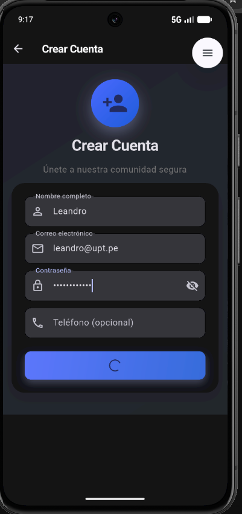

# Examen Unidad II - Práctica de Validaciones

**Curso:** Desarrollo de Aplicaciones Móviles II
**Estudiante:** Leandro Diego Hurtado Ortiz
**Universidad:** Universidad Privada de Tacna (UPT)
**Fecha:** 02 de Junio de 2026
**Repositorio:** https://github.com/leandrodho/SM2_EXAMEN_VALIDACIONES

## Detalle Técnico de la Implementación

Para esta evaluación, se reestructuró la pantalla de registro de la aplicación SafeArea (`register_screen.dart`). Se reemplazaron los inputs genéricos por el uso estricto de `Form`, `GlobalKey<FormState>` y `TextFormField` para aprovechar el sistema nativo de validación de Flutter.

Se implementaron las siguientes Expresiones Regulares (RegExp) en Dart para asegurar la robustez de los datos:

1. **Validación de Correo Electrónico:**
   `RegExp(r'^[\w-\.]+@([\w-]+\.)+[\w-]{2,4}$')`
   *Explicación:* Asegura que el usuario ingrese una estructura de correo estándar, verificando la existencia de caracteres alfanuméricos, un símbolo arroba (`@`), un dominio y una extensión válida de 2 a 4 caracteres.

2. **Validación de Contraseña de Alta Seguridad:**
   `RegExp(r'^(?=.*[a-z])(?=.*[A-Z])(?=.*\d)[a-zA-Z\d]{8,}$')`
   *Explicación:* Obliga a que la contraseña tenga un mínimo de 8 caracteres de longitud, exigiendo al menos una letra mayúscula, una letra minúscula y un número, mejorando significativamente la seguridad del registro.

Adicionalmente, se configuraron teclados virtuales específicos (`TextInputType.emailAddress`, `TextInputType.phone`) y se ocultó el texto de la contraseña dinámicamente. Se integró un retardo artificial de 2 segundos mediante `Future.delayed` para simular asincronía, alterando el estado de la interfaz gráfica y mostrando un `CircularProgressIndicator` en el botón de envío.

## Evidencias Visuales

